# C4 Model — Level 3: Component Diagram — Dashboard UI (Feature-Sliced Design)

Decomposition of the **Dashboard UI** container from the [Container Diagram](c4-container.md) (container 14) into internal components, organized by **Feature-Sliced Design (FSD)** methodology.

> **Level**: C4 Component (Level 3) — zoom into Dashboard UI
> **Parent**: [C4 Container Diagram](c4-container.md)
> **PRD**: [dashboard-prd.md](../prd/dashboard-prd.md)
> **Architecture methodology**: [Feature-Sliced Design](https://feature-sliced.design/)

---

## Feature-Sliced Design Overview

Dashboard UI follows the **Feature-Sliced Design (FSD)** architectural methodology. Code is organized into 6 layers with strict unidirectional imports:

```
app  →  pages  →  widgets  →  features  →  entities  →  shared
 ▲                                                         │
 └─────────── each layer imports ONLY from lower layers ───┘
```

**Layer responsibilities**:

| Layer | Purpose | May import from |
|-------|---------|-----------------|
| `shared` | Infrastructure, design system, API client, utilities | — (lowest layer) |
| `entities` | Business entities: session, metric, notification, team, user | `shared` |
| `features` | User-facing capabilities: filtering, export, auth, theme | `shared`, `entities` |
| `widgets` | Composite UI blocks: app shell, sidebar, data table | `shared`, `entities`, `features` |
| `pages` | Full page compositions with page-specific data hooks | `shared`, `entities`, `features`, `widgets` |
| `app` | Providers, global configuration, middleware | all layers |

Each layer consists of **slices** (domain groupings), and each slice has **segments**: `ui/`, `model/`, `api/`, `lib/`, `config/`.

---

## Project File Structure

Next.js App Router (`app/`) handles routing. FSD layers live in `src/`. Route files are thin wrappers importing page compositions from the FSD `pages/` layer.

```
project-root/
├── app/                                    ← Next.js App Router (routing only)
│   ├── middleware.ts                       ← Edge auth (imports from src/app/)
│   ├── dashboard/
│   │   ├── layout.tsx                      ← Server Component → imports src/app/providers
│   │   ├── loading.tsx                     ← DashboardSkeleton (global fallback)
│   │   ├── error.tsx                       ← DashboardErrorBoundary (Sentry-integrated)
│   │   ├── page.tsx                        ← thin wrapper → pages/executive-overview
│   │   ├── adoption/
│   │   │   ├── page.tsx                    ← thin wrapper → pages/adoption
│   │   │   └── [teamId]/page.tsx           ← thin wrapper → pages/adoption (team drill-down)
│   │   ├── delivery/
│   │   │   ├── page.tsx                    ← thin wrapper → pages/delivery
│   │   │   └── [teamId]/page.tsx           ← thin wrapper → pages/delivery (team drill-down)
│   │   ├── cost/
│   │   │   ├── page.tsx                    ← thin wrapper → pages/cost
│   │   │   └── [teamId]/page.tsx           ← thin wrapper → pages/cost (team drill-down)
│   │   ├── quality/page.tsx                ← thin wrapper → pages/quality
│   │   ├── operations/page.tsx             ← thin wrapper → pages/operations
│   │   ├── sessions/[sessionId]/page.tsx   ← thin wrapper → pages/session-deep-dive
│   │   └── settings/page.tsx               ← thin wrapper → pages/settings
│   └── api/auth/
│       ├── callback/route.ts               ← Auth code exchange → JWT cookie
│       ├── logout/route.ts                 ← Clear cookie + IdP logout
│       ├── refresh/route.ts                ← Silent token rotation
│       └── me/route.ts                     ← Current user from JWT claims
│
└── src/                                    ← FSD layers
    ├── app/                                ← Layer 6: Application (providers, global config)
    │   ├── providers.tsx
    │   └── middleware.ts
    ├── pages/                              ← Layer 5: Page compositions
    │   ├── executive-overview/
    │   │   ├── ui/
    │   │   └── api/
    │   ├── adoption/
    │   ├── delivery/
    │   ├── cost/
    │   ├── quality/
    │   ├── operations/
    │   ├── session-deep-dive/
    │   └── settings/
    ├── widgets/                            ← Layer 4: Composite UI blocks
    │   ├── app-shell/
    │   ├── sidebar-nav/
    │   ├── breadcrumbs/
    │   ├── notification-center/
    │   ├── user-menu/
    │   ├── empty-state/
    │   ├── data-table/
    │   ├── session-timeline/
    │   └── cost-breakdown/
    ├── features/                           ← Layer 3: User-facing capabilities
    │   ├── filter-management/
    │   ├── export-data/
    │   ├── theme-switching/
    │   └── auth/
    ├── entities/                           ← Layer 2: Business entities
    │   ├── session/
    │   ├── metric/
    │   ├── notification/
    │   ├── team/
    │   └── user/
    └── shared/                             ← Layer 1: Shared infrastructure
        ├── ui/
        ├── api/
        ├── config/
        ├── lib/
        ├── model/
        └── __mocks__/
```

### Server vs Client Component Boundary

| Layer | Component Type | Rationale |
|-------|---------------|-----------|
| `app/dashboard/layout.tsx` | **Server Component** | Static shell, metadata, provider initialization |
| `app/dashboard/*/page.tsx` | **Server Component** | Route-level metadata, prefetch hints for TanStack Query |
| All FSD layers (`src/`) | **Client Components** (`'use client'`) | Charts, filters, sidebar, stores — require browser APIs and interactivity |
| `app/middleware.ts` | **Next.js Middleware** | Runs at edge: JWT validation, role-based route protection before render |

---

## Component Diagram

```mermaid
C4Component
    title Component Diagram — Dashboard UI (Feature-Sliced Design)

    Container_Ext(analyticsApi, "Analytics API", "Go, REST", "Dashboard queries, privacy enforcement, export")
    Container_Ext(apiGateway, "API Gateway", "Envoy / Kong", "Routing, rate limiting, JWT validation")
    Container_Ext(identityService, "Identity & Access Service", "WorkOS/Auth0 + OPA/Cedar", "SSO, RBAC/ABAC, JWT, user profile storage")

    Container_Boundary(dashboardUI, "Dashboard UI (React / Next.js App Router + FSD)") {

        Boundary(sharedLayer, "shared/ — Shared Infrastructure") {
            Component(designSystem, "Design System", "Shadcn UI (Radix UI + Tailwind CSS)", "Button, Card, Table, Skeleton, Input, Select, DatePicker, Badge, Tooltip, Modal, Dialog, Icon")
            Component(apiClient, "API Client", "openapi-typescript + Zod", "Auto-generated types, fetch wrapper, JWT injection, runtime response validation")
            Component(queryKeyFactory, "Query Key Factory", "TypeScript", "Centralized key generation: queryKeys.{view}(filters)")
            Component(uiStore, "UIStore", "MobX", "Sidebar collapsed, mobile breakpoint (localStorage)")
            Component(mswHandlers, "MSW Handlers", "MSW", "Mock API for testing, generated from OpenAPI + JSON fixtures")
            Component(sharedConfig, "Config", "TypeScript", "Route constants, RBAC permission map, environment config")
            Component(sharedLib, "Lib", "TypeScript", "PostHog helpers, Sentry helpers, i18n (next-intl), date/number formatters")
        }

        Boundary(entitiesLayer, "entities/ — Business Entities") {
            Component(sessionEntity, "session", "Entity", "model/ types, api/ useSession hook")
            Component(metricEntity, "metric", "Entity", "ui/ KPICard, DeltaIndicator, ChartContainer; model/ metric types")
            Component(notificationEntity, "notification", "Entity", "ui/ NotificationItem; model/ NotificationStore; api/ useNotifications (60s poll)")
            Component(teamEntity, "team", "Entity", "model/ team types")
            Component(userEntity, "user", "Entity", "model/ UserSettingsStore; api/ useProfile, useSettings, useUpdateProfile, useUpdateSettings")
        }

        Boundary(featuresLayer, "features/ — User-Facing Capabilities") {
            Component(filterMgmt, "filter-management", "Feature", "ui/ FilterBar, DateRangePicker, PeriodComparisonToggle; model/ FilterStore; lib/ URLSyncProvider")
            Component(exportData, "export-data", "Feature", "ui/ ExportButton — CSV/NDJSON export with current filters")
            Component(themeSwitching, "theme-switching", "Feature", "ui/ ThemeToggle — light/dark theme switch")
            Component(authFeature, "auth", "Feature", "ui/ AuthGuard (client-side RBAC); model/ AuthStore (user, role, org_id, permissions)")
        }

        Boundary(widgetsLayer, "widgets/ — Composite UI Blocks") {
            Component(appShell, "app-shell", "Widget", "Root layout: sidebar + header + content area")
            Component(sidebarNav, "sidebar-nav", "Widget", "6 views + Settings; active route; collapsible on mobile")
            Component(breadcrumbs, "breadcrumbs", "Widget", "Auto from route: Dashboard > View > Team > Session")
            Component(notifCenter, "notification-center", "Widget", "Bell icon + unread badge + dropdown; mark read / dismiss")
            Component(userMenu, "user-menu", "Widget", "Avatar dropdown: profile, settings link, IdP link, logout")
            Component(emptyState, "empty-state", "Widget", "Onboarding guide or no-data-for-filters")
            Component(dataTable, "data-table", "Widget", "Cursor pagination, sortable, row click drill-down")
            Component(sessionTimeline, "session-timeline", "Widget", "SessionTimeline, StepDetailPanel, DiffViewer")
            Component(costBreakdown, "cost-breakdown", "Widget", "Per-step cost bar chart + total session KPI")
        }

        Boundary(pagesLayer, "pages/ — Page Compositions") {
            Component(execPage, "executive-overview", "Page", "api/ useOverview; KPIs, trends, risk posture")
            Component(adoptPage, "adoption", "Page", "api/ useAdoption; DAU/WAU/MAU, funnel, team drill-down")
            Component(delivPage, "delivery", "Page", "api/ useDelivery; PRs, TTM, agent vs non-agent, team drill-down")
            Component(costPage, "cost", "Page", "api/ useCost; spend, forecast, budget, team drill-down")
            Component(qualPage, "quality", "Page", "api/ useQuality; CI, reviews, violations")
            Component(opsPage, "operations", "Page", "api/ useOperations (60s poll); queue, failures, SLA")
            Component(sessionPage, "session-deep-dive", "Page", "Uses entities/session; sub-page via drill-down only")
            Component(settingsPage, "settings", "Page", "Uses entities/user; theme, timezone, digests")
        }

        Boundary(appLayer, "app/ — Application Layer") {
            Component(providers, "Providers", "React Context", "PostHog > Sentry > I18n > Theme > QueryClient > MobX stores > URLSync > AuthGuard")
            Component(middleware, "Auth Middleware", "Next.js Middleware", "Edge: JWT validation, role-based route protection, IdP redirect")
            Component(authRoutes, "Auth Route Handlers", "Next.js Route Handlers", "/api/auth/callback, /logout, /refresh, /me")
        }
    }

    %% External relationships
    Rel(middleware, identityService, "Validates JWT, extracts role", "HTTPS")
    Rel(authRoutes, identityService, "Auth code exchange, token refresh", "HTTPS")
    Rel(apiClient, analyticsApi, "Dashboard queries + notifications", "HTTPS / REST")
    Rel(apiClient, apiGateway, "User profile + settings", "HTTPS / REST")

    %% FSD layer relationships (top-down only)
    %% app → pages
    Rel(providers, appShell, "Wraps app shell")

    %% pages → widgets + features + entities
    Rel(execPage, metricEntity, "Uses KPICard, ChartContainer")
    Rel(execPage, filterMgmt, "Uses FilterBar, DateRangePicker")
    Rel(sessionPage, sessionTimeline, "Composes SessionTimeline, StepDetailPanel, DiffViewer")
    Rel(sessionPage, costBreakdown, "Composes CostBreakdown")
    Rel(sessionPage, sessionEntity, "Uses useSession(sessionId)")
    Rel(settingsPage, userEntity, "Uses useSettings, useUpdateSettings")
    Rel(opsPage, metricEntity, "Uses KPICard, ChartContainer")

    %% widgets → features + entities + shared
    Rel(appShell, sidebarNav, "Contains sidebar")
    Rel(appShell, notifCenter, "Contains in header")
    Rel(appShell, userMenu, "Contains in header")
    Rel(appShell, breadcrumbs, "Contains in content area")
    Rel(appShell, themeSwitching, "Contains ThemeToggle in header")
    Rel(notifCenter, notificationEntity, "Reads NotificationStore, dispatches actions")
    Rel(userMenu, authFeature, "Reads AuthStore (user, role)")
    Rel(dataTable, designSystem, "Extends shared/ui/Table")

    %% features → entities + shared
    Rel(filterMgmt, apiClient, "FilterStore included in query keys")
    Rel(authFeature, sharedConfig, "Reads RBAC permission map")

    %% entities → shared
    Rel(notificationEntity, apiClient, "useNotifications (60s polling)")
    Rel(userEntity, apiClient, "useProfile, useSettings via API Gateway")
    Rel(metricEntity, designSystem, "KPICard extends Card, ChartContainer uses Skeleton")
    Rel(sessionEntity, apiClient, "useSession(sessionId)")

    %% shared internal
    Rel(apiClient, queryKeyFactory, "Generates cache keys from filters")
```



---

## Layer 1: `shared/` — Shared Infrastructure

The lowest layer. Provides design system, API client, utilities, and configuration. No business logic.

### `shared/ui/` — Design System

Components are based on **Shadcn UI** — accessible Radix UI primitives styled with Tailwind CSS. Shadcn CLI copies component source into `src/shared/ui/`, giving full ownership and customization without runtime dependency. Components are shared between Dashboard UI and Web App UI for visual consistency.

| Component | Description |
|-----------|-------------|
| **Button** | Primary, secondary, ghost, icon variants; disabled, loading states |
| **Input** / **Select** | Text input, multi-select with search, consistent Tailwind styling |
| **DatePicker** | Single date + date range calendar; base for dashboard's DateRangePicker |
| **Card** | Container: header, body, optional footer, hover state |
| **Badge** | Status indicators (success/warning/error), count badges |
| **Tooltip** | Hover/focus with accessible markup (`role="tooltip"`, `aria-describedby`) |
| **Modal** / **Dialog** | Confirmation dialogs, detail panels, keyboard trap, focus management |
| **Skeleton** | Loading placeholders: line, rectangle, circle shapes |
| **Table** | Base: sortable columns, row selection, responsive overflow |
| **Icon** | Icon system (Lucide); consistent sizing (16/20/24px) |

### `shared/api/` — API Client & Validation

| Component | Description |
|-----------|-------------|
| **API Client** | Auto-generated TypeScript types from `openapi.yaml` via `openapi-typescript` (CI step). Thin `fetch` wrapper: base URL configuration, JWT header injection (`Authorization: Bearer <token>`), response error handling (throws on 4xx/5xx). No business logic — pure HTTP transport. |
| **Zod Schemas** | Generated from OpenAPI spec (or manually maintained with CI validation against spec). Every API response parsed through Zod before entering TanStack Query cache. Catches contract drift at runtime (Zod parse error → Sentry error → alert). |
| **Query Key Factory** | Centralized query key generation ensures consistent cache keys: `queryKeys.overview(filters) → ['analytics', 'overview', { team: [...], range: '30d', ... }]`. Filter changes → new query key → TanStack Query auto-refetches. |
| **QueryClient config** | TanStack Query client defaults: `staleTime: 5 * 60 * 1000` (5 min), `gcTime: 30 * 60 * 1000` (30 min), `retry: 2`, `refetchOnWindowFocus: true`. |

### `shared/config/` — Configuration

| Item | Description |
|------|-------------|
| **Route constants** | Typed route map for all dashboard paths |
| **RBAC permission map** | Route → allowed roles mapping (used by middleware and AuthGuard) |
| **Environment config** | API base URLs, PostHog project key, Sentry DSN |

### `shared/lib/` — Utilities

| Item | Description |
|------|-------------|
| **PostHog helpers** | Init PostHog SDK (self-hosted/EU), hashed `user_id`, autocapture off, route change tracking via `usePathname()`. Custom events: `view_visited`, `filter_applied`, `export_triggered`. |
| **Sentry helpers** | Init Sentry SDK, global error boundary, Web Vitals reporting (LCP, INP, CLS, TTFB), source maps upload in CI, session replay on error. |
| **i18n setup** | `next-intl` configuration, EN translation message loading, `useTranslations()` hook setup. i18n-ready: adding a language = adding a translation file. |
| **Date/number formatters** | Locale-aware formatting utilities for metrics display. |

### `shared/model/` — UI Store

| Store | Responsibility | Persistence |
|-------|---------------|-------------|
| **UIStore** | `sidebarCollapsed: boolean`, `isMobile: boolean` (from `matchMedia`) | `localStorage` |

UIStore contains no business logic — only presentation state. Consumed by `widgets/app-shell` and `widgets/sidebar-nav`.

### `shared/__mocks__/` — Test Infrastructure

| Item | Description |
|------|-------------|
| **MSW Handlers** | Mock API handlers generated from OpenAPI spec + JSON fixture files. Used in Jest (unit/integration) and Playwright (E2E) tests. |
| **JSON Fixtures** | Realistic synthetic dataset matching ClickHouse schema for consistent test data. |

---

## Layer 2: `entities/` — Business Entities

Domain objects with their types, stores, API hooks, and presentational UI. Each entity is a self-contained slice.

### `entities/session/`

| Segment | Contents |
|---------|----------|
| `model/` | `Session`, `SessionStep`, `StepType` (Think / Act / Observe) types |
| `api/` | `useSession(sessionId)` — TanStack Query hook, `GET /v1/analytics/sessions/:id`, on page load + manual refresh |

### `entities/metric/`

| Segment | Contents |
|---------|----------|
| `ui/` | **KPICard** — Value + label + sparkline (Recharts Sparkline) + DeltaIndicator; skeleton loading state; extends `shared/ui/Card`. **DeltaIndicator** — `↑12%` (green) / `↓5%` (red) / `—` (neutral); includes accessible `aria-label`. **ChartContainer** — Recharts wrapper providing: skeleton loading, inline error with retry button, empty state message, ARIA labels on chart, data table fallback for screen readers. |
| `model/` | `Metric`, `KPIValue`, `ChartDataPoint` types |

### `entities/notification/`

| Segment | Contents |
|---------|----------|
| `ui/` | **NotificationItem** — Single notification card: type icon, message, timestamp, link to relevant view |
| `model/` | **NotificationStore** (MobX) — `unreadCount: number`, `notifications: Notification[]`, `markRead(id)`, `dismiss(id)`. In-memory; synced with Analytics API via `useNotifications()` polling. |
| `api/` | `useNotifications()` — TanStack Query hook, `GET /v1/analytics/notifications`, **polling: `refetchInterval: 60_000`** (60s). `useMarkNotification()` — mutation, `PATCH /v1/analytics/notifications/:id`. |

### `entities/team/`

| Segment | Contents |
|---------|----------|
| `model/` | `Team`, `TeamMember` types |

### `entities/user/`

| Segment | Contents |
|---------|----------|
| `model/` | **UserSettingsStore** (MobX) — `theme: 'light' | 'dark' | 'system'`, `timezone: string`, `defaultView: string`, `defaultDateRange: Record<view, range>`, `digestFrequency`, `digestScope`, `language`. Persisted via User profile API + `localStorage` cache. |
| `api/` | `useProfile()` — `GET /v1/user/profile` (via API Gateway), on app init. `useSettings()` — `GET /v1/user/settings` (via API Gateway), on app init. `useUpdateProfile()` — mutation, `PATCH /v1/user/profile`. `useUpdateSettings()` — mutation, `PATCH /v1/user/settings`. |

---

## Layer 3: `features/` — User-Facing Capabilities

Discrete user interactions that combine entities and shared infrastructure. Each feature is a self-contained slice.

### `features/filter-management/`

| Segment | Contents |
|---------|----------|
| `ui/` | **FilterBar** — Global filters: team, repo, language, model, task type; renders as removable chips below DateRangePicker; composable AND logic. **DateRangePicker** — Presets (7d / 30d / 90d / Custom), dual calendar for custom range, per-view defaults (Ops = 7d, others = 30d); uses `shared/ui/DatePicker`. **PeriodComparisonToggle** — "Compare to previous period" switch; enables delta indicators on KPICards + dashed overlay lines on charts. |
| `model/` | **FilterStore** (MobX) — Active filters: `team_id[]`, `repo_id[]`, `model`, `task_type`, `language`, `time_range`, `granularity`, `comparison` toggle. Synced with URL query params via URLSyncProvider. Read by all page-level query hooks (filter values included in query keys for automatic cache invalidation). |
| `lib/` | **URLSyncProvider** — React context + MobX reaction providing two-way synchronization. On mount: reads `URLSearchParams` → initializes FilterStore. On filter change: MobX `reaction` on FilterStore → updates URL via `router.replace(url, { scroll: false })` (shallow, no page reload). On browser back/forward: `popstate` event → updates FilterStore from URL. |

### `features/export-data/`

| Segment | Contents |
|---------|----------|
| `ui/` | **ExportButton** — Dropdown: CSV / NDJSON; triggers download respecting current filters and date range; disabled during export. Uses `shared/ui/Button`. |

### `features/theme-switching/`

| Segment | Contents |
|---------|----------|
| `ui/` | **ThemeToggle** — Light/dark switch icon in header. Reads/writes `entities/user/model/UserSettingsStore`. **ThemeProvider** — React context: reads preference chain (UserSettingsStore → `localStorage('theme')` → `prefers-color-scheme` media query), applies `dark` class to `<html>` (Tailwind `class` strategy). Rendered in provider tree (see app layer). |

### `features/auth/`

| Segment | Contents |
|---------|----------|
| `ui/` | **AuthGuard** — Client-side RBAC: reads `AuthStore.role` and `AuthStore.permissions`, conditionally renders children or restricted-access fallback. Complements server-side middleware (which handles route-level blocking). |
| `model/` | **AuthStore** (MobX) — `user: { id, email, name }`, `role: Role`, `org_id: string`, `permissions: string[]` — parsed from JWT claims on app init via `/api/auth/me` endpoint. |

---

## Layer 4: `widgets/` — Composite UI Blocks

Complex UI assemblies that compose entities, features, and shared components. Widgets are domain-aware but reusable across pages.

### `widgets/app-shell/`

| Component | Description | Dependencies |
|-----------|-------------|-------------|
| **AppShell** | Root layout: sidebar + header (NotificationCenter, ThemeToggle, UserMenu) + scrollable content area | `widgets/sidebar-nav`, `widgets/notification-center`, `widgets/user-menu`, `widgets/breadcrumbs`, `features/theme-switching` |

### `widgets/sidebar-nav/`

| Component | Description | Dependencies |
|-----------|-------------|-------------|
| **SidebarNav** | 6 view links (Executive, Adoption, Delivery, Cost, Quality, Ops) + Settings at bottom; active route highlighted; collapses to hamburger on mobile. Session Deep-Dive is not in sidebar — reached via drill-down only. | `shared/model/UIStore` (collapsed state), `shared/config/` (route constants) |

### `widgets/breadcrumbs/`

| Component | Description | Dependencies |
|-----------|-------------|-------------|
| **Breadcrumbs** | Auto-generated from Next.js route path; each segment clickable. Pattern: `Dashboard > [View] > [Team] > [Session]`. | Next.js `usePathname` |

### `widgets/notification-center/`

| Component | Description | Dependencies |
|-----------|-------------|-------------|
| **NotificationCenter** | Bell icon in header + unread count badge + dropdown list. Notification types: budget alert, SLA breach, policy violation. Each links to relevant view. Mark as read / dismiss actions. | `entities/notification` (NotificationStore, NotificationItem, useNotifications) |

### `widgets/user-menu/`

| Component | Description | Dependencies |
|-----------|-------------|-------------|
| **UserMenu** | Avatar dropdown in header: profile info (name, email, role, org), link to Settings, "Manage account in IdP" external link, Logout button. | `features/auth` (AuthStore), `entities/user` (UserSettingsStore) |

### `widgets/empty-state/`

| Component | Description | Dependencies |
|-----------|-------------|-------------|
| **EmptyState** | Two variants: (1) Onboarding for new orgs — guide: connect repo → run task → view analytics, with sample data preview; (2) No-data-for-filters — message + reset filters button. | `features/filter-management` (reset action) |

### `widgets/data-table/`

| Component | Description | Dependencies |
|-----------|-------------|-------------|
| **DataTable** | Extends `shared/ui/Table`: cursor-based pagination (next/prev), sortable columns, row click → navigates to drill-down route. | `shared/ui/Table` |

### `widgets/session-timeline/`

| Component | Description | Dependencies |
|-----------|-------------|-------------|
| **SessionTimeline** | Vertical timeline of agent steps. Each step card: type icon (Think / Act / Observe), duration bar, cost label, status badge (success/error/skipped). Color-coded by type. Error steps highlighted. Steps collapsible. | — |
| **StepDetailPanel** | Expanded view on step click. **Think**: LLM prompt summary, model name, tokens in/out, response summary, reasoning chain excerpt. **Act**: tool call name, arguments (JSON), result summary, duration. **Observe**: file diffs (→ DiffViewer), test output, CI results. | DiffViewer |
| **DiffViewer** | Side-by-side diff with syntax highlighting. File tree navigation for multi-file changes. Collapsible hunks. Line numbers. Copy button. | — |

### `widgets/cost-breakdown/`

| Component | Description | Dependencies |
|-----------|-------------|-------------|
| **CostBreakdown** | Per-step horizontal bar chart: LLM cost (by model) + compute cost. Total session cost as KPICard at top. Cost by model breakdown if multiple models used. | `entities/metric` (ChartContainer, KPICard) |

---

## Layer 5: `pages/` — Page Compositions

Each page slice contains `ui/` (page composition component) and `api/` (page-specific TanStack Query hooks). Pages compose widgets, features, and entities.

| Page Slice | Route | Key Composed Components | Query Hook | Refetch Strategy |
|------------|-------|------------------------|------------|-----------------|
| `pages/executive-overview/` | `/dashboard` | KPICard, ChartContainer (area), DeltaIndicator, FilterBar | `useOverview(filters)` | On page load + manual refresh |
| `pages/adoption/` | `/dashboard/adoption` | ChartContainer (line, funnel, pie, bar), DataTable, FilterBar | `useAdoption(filters)` | On page load + manual refresh |
| `pages/delivery/` | `/dashboard/delivery` | ChartContainer (bar, line, grouped bar), DataTable, FilterBar | `useDelivery(filters)` | On page load + manual refresh |
| `pages/cost/` | `/dashboard/cost` | ChartContainer (stacked bar, area), KPICard, FilterBar | `useCost(filters)` | On page load + manual refresh |
| `pages/quality/` | `/dashboard/quality` | ChartContainer (bar, pie), DataTable (violations), FilterBar | `useQuality(filters)` | On page load + manual refresh |
| `pages/operations/` | `/dashboard/operations` | ChartContainer (area, bar), KPICard, FilterBar | `useOperations(filters)` | **Polling: `refetchInterval: 60_000`** (60s) |
| `pages/session-deep-dive/` | `/dashboard/sessions/[sessionId]` | SessionTimeline, StepDetailPanel, DiffViewer, CostBreakdown | `entities/session/api/useSession` | On page load + manual refresh |
| `pages/settings/` | `/dashboard/settings` | Design System form controls | `entities/user/api/useSettings` | On app init |

### Drill-Down Routing

```
Dashboard > [View] > [Team] > [Session]
   /dashboard     /dashboard/adoption     /dashboard/adoption/team-123     /dashboard/sessions/sess-456
```

- Each level is a separate Next.js route (not a modal)
- Breadcrumbs reflect the full hierarchy with clickable links
- Session Deep-Dive is **not in the sidebar** — reached only via drill-down from session rows in Adoption, Delivery, or Operations views
- Team drill-down routes exist for: Adoption, Delivery, Cost (views that have team-level breakdowns)

---

## Layer 6: `app/` — Application Layer

Top-level orchestration: providers, middleware, auth route handlers.

### Provider Nesting Order

Defined in `src/app/providers.tsx`, rendered by `app/dashboard/layout.tsx` (Server Component):

```
<PostHogProvider>
  <SentryProvider>
    <I18nProvider locale="en" messages={messages}>
      <ThemeProvider>
        <QueryClientProvider client={queryClient}>
          <MobXStoresProvider>
            <URLSyncProvider>
              <AuthGuard>
                <AppShell>
                  {children}    ← page content
                </AppShell>
              </AuthGuard>
            </URLSyncProvider>
          </MobXStoresProvider>
        </QueryClientProvider>
      </ThemeProvider>
    </I18nProvider>
  </SentryProvider>
</PostHogProvider>
```

| Provider | Source (FSD layer) | Responsibility |
|----------|-------------------|---------------|
| **PostHogProvider** | `shared/lib/` | Product analytics: page views, interactions, funnels |
| **SentryProvider** | `shared/lib/` | Error tracking, Web Vitals, session replay on error |
| **I18nProvider** | `shared/lib/` | `next-intl` locale + messages |
| **ThemeProvider** | `features/theme-switching/` | Dark/light mode, system preference detection |
| **QueryClientProvider** | `shared/api/` | TanStack Query cache config |
| **MobXStoresProvider** | — | React context providing all MobX store instances |
| **URLSyncProvider** | `features/filter-management/lib/` | Two-way FilterStore ↔ URL sync |
| **AuthGuard** | `features/auth/ui/` | Client-side RBAC |
| **AppShell** | `widgets/app-shell/` | Root layout (sidebar + header + content) |

### Auth Middleware (`app/middleware.ts`)

Handles both authentication (is the user logged in?) and authorization (can they access this route?). Imports configuration from `src/app/middleware.ts` which uses `shared/config/` (RBAC permission map).

**Authentication flow** (no custom login page — redirect to IdP):

```
User visits /dashboard/*
       │
       ▼
middleware.ts (runs at edge)
       │
  JWT cookie present & valid?
       │
  ┌────┴────┐
  No        Yes
  │         │
  ▼         ▼
Redirect    Extract role + org_id
to IdP      from JWT claims
(WorkOS /        │
 Okta /          ▼
 Azure AD)  Check route permissions
  │         (authorization, see table below)
  ▼              │
SSO login   ┌────┴────┐
(SAML/OIDC) Allowed   Denied
  │         │         │
  ▼         ▼         ▼
Callback    Render    Redirect to
route       page      default view
```

**Auth API routes** (Next.js Route Handlers):

| Route | Description |
|-------|-------------|
| `/api/auth/callback` | Receives auth code from IdP, exchanges for JWT, sets `httpOnly` secure cookie, redirects to `/dashboard` |
| `/api/auth/logout` | Clears JWT cookie, redirects to IdP logout endpoint for full session termination |
| `/api/auth/refresh` | Silent token rotation — called before JWT expiry to issue a new token without user interaction |
| `/api/auth/me` | Returns current user profile parsed from JWT claims (used by AuthStore on client init) |

**Authorization** — route-level permission map (from `shared/config/`):

| Route Pattern | Allowed Roles |
|---------------|---------------|
| `/dashboard` (Executive Overview) | VP/CTO, Eng Mgr, FinOps |
| `/dashboard/adoption` | VP/CTO, Eng Mgr, Platform Eng, IC Dev (own team) |
| `/dashboard/delivery` | VP/CTO, Eng Mgr, Platform Eng, IC Dev (own team) |
| `/dashboard/cost` | VP/CTO, Eng Mgr, FinOps |
| `/dashboard/quality` | Eng Mgr, Security |
| `/dashboard/operations` | Eng Mgr, Platform Eng |
| `/dashboard/sessions/*` | Eng Mgr, Platform Eng, Security (audit), IC Dev (own sessions) |
| `/dashboard/settings` | All roles |

---

## Data Flow

```
User clicks filter ──→ FilterBar ──→ FilterStore.setFilter()
    (features/filter-management)        (features/filter-management/model)
                                              │
                    ┌─────────────────────────┤
                    ▼                         ▼
            URLSyncProvider           Query key changes
   (features/filter-management/lib)        │
            (FilterStore → URL)            ▼
                                    TanStack Query refetch
                                           │
                                           ▼
                                    API Client (fetch)
                                    (shared/api)
                                           │
                                           ▼
                                    Zod validation
                                    (shared/api)
                                           │
                                      ┌────┴────┐
                                      ▼         ▼
                                 Cache update   Error → Sentry
                                      │              (shared/lib)
                                      ▼
                             Component re-render
                             (MobX observer + useQuery data)
```

---

## Relationships

### Component → External Container

| From (FSD path) | To | Protocol | Data |
|------------------|----|----------|------|
| `app/` Auth Middleware | Identity & Access Service | HTTPS | JWT validation, role extraction |
| `app/` Auth Route Handlers | Identity & Access Service | HTTPS | Auth code exchange, token refresh, logout |
| `shared/api/` API Client | Analytics API | HTTPS (REST) | All dashboard queries (`/v1/analytics/*`), notifications |
| `shared/api/` API Client | API Gateway | HTTPS (GET/PATCH) | User profile (`/v1/user/profile`) and settings (`/v1/user/settings`). API Gateway routes to Identity & Access Service. |

### Cross-Layer Interactions (key flows)

| From (layer) | To (layer) | Interaction |
|--------------|------------|-------------|
| `pages/*` | `features/filter-management` | All analytics pages compose FilterBar, DateRangePicker |
| `pages/*` | `entities/metric` | All analytics pages use KPICard, ChartContainer |
| `pages/*` | `widgets/data-table` | Adoption, Delivery, Quality pages compose DataTable |
| `pages/session-deep-dive` | `widgets/session-timeline` | Composes SessionTimeline, StepDetailPanel, DiffViewer |
| `pages/session-deep-dive` | `widgets/cost-breakdown` | Composes CostBreakdown |
| `pages/session-deep-dive` | `entities/session` | Uses `useSession(sessionId)` |
| `pages/settings` | `entities/user` | Uses `useSettings()`, `useUpdateSettings()` |
| `widgets/app-shell` | `widgets/sidebar-nav` | Contains sidebar |
| `widgets/app-shell` | `widgets/notification-center` | Contains in header |
| `widgets/app-shell` | `widgets/user-menu` | Contains in header (avatar dropdown) |
| `widgets/app-shell` | `widgets/breadcrumbs` | Contains in content area |
| `widgets/notification-center` | `entities/notification` | Reads NotificationStore, renders NotificationItems |
| `widgets/user-menu` | `features/auth` | Reads AuthStore (user profile for display) |
| `widgets/user-menu` | `entities/user` | Reads UserSettingsStore |
| `widgets/app-shell` | `features/theme-switching` | Contains ThemeToggle in header |
| `widgets/data-table` | `shared/ui` | Extends `Table` component |
| `features/filter-management` | `shared/api` | FilterStore values included in query keys |
| `features/theme-switching` | `entities/user` | Reads/writes UserSettingsStore |
| `features/auth` | `shared/config` | Reads RBAC permission map |
| `entities/notification` | `shared/api` | `useNotifications()` → API Client → Analytics API (60s polling) |
| `entities/user` | `shared/api` | `useProfile()`, `useSettings()` → API Client → API Gateway |
| `entities/metric` | `shared/ui` | KPICard extends Card; ChartContainer uses Skeleton |
| `entities/session` | `shared/api` | `useSession()` → API Client → Analytics API |

---

## Architectural Decisions

| # | Decision | Rationale | Trade-off |
|---|----------|-----------|-----------|
| 1 | **Feature-Sliced Design (FSD) methodology** | Strict layer boundaries enable isolated testing per slice, predictable dependency graph (DAG), and clear ownership. Unidirectional imports prevent circular dependencies. | Learning curve for developers unfamiliar with FSD; `pages/` naming collision with Next.js `app/` (resolved by separating `app/` routing from `src/pages/` compositions) |
| 2 | **Next.js `app/` for routing + `src/` for FSD layers** | Next.js App Router requires file-based routing in `app/`. FSD layers live in `src/` with thin `page.tsx` wrappers in `app/` that import page compositions. Standard FSD + Next.js pattern. | Two directories to understand (`app/` and `src/`); thin wrappers are boilerplate but keep routing concerns separated |
| 3 | **Server Components for layout/pages, Client for FSD layers** | Maximizes SSR benefits (metadata, initial load) while allowing full interactivity for charts and filters | Clear `'use client'` boundary needed; can't use MobX stores in Server Components |
| 4 | **Dual RBAC: middleware + AuthGuard** | Middleware blocks routes at edge (security); AuthGuard hides UI elements client-side (UX) | Two places to maintain permission map (centralized in `shared/config/`); must stay in sync |
| 5 | **MobX for UI state + TanStack Query for server state** | MobX excels at observable UI state (filters, theme); TanStack Query excels at server cache (deduplication, background refetch, stale-while-revalidate) | Two state management paradigms; team must understand both |
| 6 | **Page-specific query hooks in `pages/{slice}/api/`** | Analytics view hooks (useOverview, useAdoption, etc.) are page-specific — only used by one page. Placing them in the page slice follows FSD's colocate-by-feature principle. | Entity-level hooks (useSession, useProfile) live in `entities/` since they're shared across pages |
| 7 | **FilterStore in `features/` (not `entities/`)** | Filtering is a user-facing capability (feature), not a business entity. FilterStore + FilterBar + URLSyncProvider form a cohesive feature slice. | Features can't import from widgets/pages, so all filter-dependent components must pass filter data down |
| 8 | **Shadcn UI as Design System** | Accessible Radix UI primitives styled with Tailwind CSS; components copied into codebase via CLI (full ownership, no runtime dependency). Visual consistency between Dashboard UI and Web App UI | Must manually sync component updates from Shadcn registry; customizations may diverge between apps |
| 9 | **Session Deep-Dive as sub-page, not sidebar view** | Deep-dive is a drill-down destination, not a primary navigation target; keeps sidebar clean (6 items + Settings) | Less discoverable; users must know to click a session row to get there |
| 10 | **60s polling for Operations and Notifications** | Simple, predictable; no WebSocket infrastructure needed for MVP | Not truly real-time; 60s lag acceptable for operational triage but not for live monitoring |

---

## Testing Strategy (FSD Isolation)

FSD's strict layer boundaries enable a layered testing strategy:

| Test Level | Scope | What to Mock | FSD Layer |
|------------|-------|-------------|-----------|
| **Unit** | Individual stores, utilities, formatters | Nothing or minimal | `shared/`, `entities/model/`, `features/model/` |
| **Slice unit** | Single slice (e.g., `features/filter-management`) | Only imports from lower layers (`shared/api/` via MSW) | `entities/`, `features/` |
| **Widget integration** | Widget composing entities + features | `shared/api/` via MSW handlers | `widgets/` |
| **Page integration** | Full page composition | `shared/api/` via MSW handlers | `pages/` |
| **E2E** | Complete user flows across pages | Real or MSW-backed API | `app/` + all layers |

**Key benefit**: unidirectional imports guarantee that mocking only `shared/api/` (via `shared/__mocks__/` MSW handlers) is sufficient to test any slice in isolation — no need to mock siblings or upper layers.
