# C4 Model — Level 2: Container Diagram

Cloud Agent Execution Platform — a managed SaaS for autonomous execution of software engineering tasks by AI agents in isolated cloud environments.

> **Level**: C4 Container (Level 2) — zoom into [System Context](c4-system-context.md)
> **Sources**: [claude_architecture_summary_research.md](../researches/cloud_agent_architecture/claude_architecture_summary_research.md), [dashboard_research_summary.md](../researches/analytics_dashboard/dashboard_research_summary.md), [gemini_architecture_research.md](../researches/cloud_agent_architecture/gemini_architecture_research.md)

---

## Container Diagram

```mermaid
C4Container
    title Container Diagram — Cloud Agent Execution Platform

    Person(developer, "Software Engineer", "Creates tasks, reviews results, merges PRs")
    Person(teamlead, "Team Lead / Reviewer", "Reviews PRs, provides mid-flight feedback")
    Person(admin, "Org Admin", "SSO, roles, policies, billing")

    Container_Boundary(control_plane, "Control Plane (Pooled)") {
        Container(webapp, "Web App UI", "React / Next.js", "Task creation, session monitoring, diff/PR review, settings")
        Container(apigw, "API Gateway", "Envoy / Kong", "Routing, rate limiting, JWT validation, WebSocket proxy")
        Container(identity, "Identity & Access Service", "WorkOS/Auth0 + OPA/Cedar", "SSO (SAML/OIDC), SCIM provisioning, RBAC/ABAC")
        Container(tenant, "Tenant & Org Management", "Go + PostgreSQL", "Org/team/project hierarchy, policies, budget limits, feature flags")
        Container(orchestrator, "Task Orchestrator", "Temporal", "Durable workflow lifecycle: plan → execute → review cycle, checkpointing")
        Container(eventbus, "Event Bus", "Kafka + NATS", "Durable event sourcing (Kafka) + real-time agent comms (NATS)")
        Container(llmgw, "LLM Gateway", "LiteLLM-based + Redis", "Multi-provider routing, tenant-aware rate limiting, circuit breakers, cost tracking")
        Container(integrations, "Integrations Hub", "Go + adapter pattern", "VCS (GitHub App), trackers (Jira/Linear), messaging (Slack/Teams), MCP, notifications")
    }

    Container_Boundary(data_plane, "Data Plane (Siloed per Session/Tenant)") {
        Container(sandbox, "Sandbox Provisioner & Runtime Fleet", "Firecracker + warm pools + Nydus", "MicroVM lifecycle, repo clone, isolation, resource limits, egress proxy")
        Container(artifacts, "Artifact & Session Store", "S3 + Redis + PostgreSQL", "Diffs, logs, test results, sandbox snapshots, session history")
    }

    Container_Boundary(analytics_plane, "Analytics Plane (Pooled, Tenant-Isolated at Data)") {
        Container(stream, "Stream Processor", "Flink / Benthos", "Event enrichment, sessionization, pre-aggregation into rollups")
        Container(olap, "OLAP Store", "ClickHouse", "Materialized views, Row-Level Security per tenant, 12-24 month retention")
        Container(analyticsapi, "Analytics API", "Go, REST + GraphQL", "Dashboard queries, cohort threshold ≥5, CSV/NDJSON/OTEL export")
        Container(dashboard, "Dashboard UI", "React / Next.js", "7 views: Executive, Adoption, Delivery, Cost, Quality, Ops, Session Deep-Dive")
        Container(export, "Customer Data Export", "Go worker", "Scheduled/on-demand export to customer S3/GCS, OTEL push (enterprise)")
    }

    Container_Boundary(crosscutting, "Cross-Cutting") {
        Container(observability, "Observability & Audit Pipeline", "OTel Collector + Prometheus + Tempo + Loki", "Telemetry (traces, metrics, logs), append-only audit, SIEM streaming")
    }

    System_Ext(vcs, "VCS Providers", "GitHub, GitLab")
    System_Ext(llm, "LLM Providers", "Anthropic, OpenAI, Google")
    System_Ext(idp, "Identity Providers", "Okta, Azure AD")
    System_Ext(trackers, "Task Trackers", "Jira, Linear")
    System_Ext(messaging, "Messaging", "Slack, Teams")
    System_Ext(cloud, "Cloud Infrastructure", "AWS, GCP, Azure")
    System_Ext(mcp, "MCP Tool Servers", "Custom tool servers")
    System_Ext(siem, "SIEM / Observability", "Splunk, Datadog")

    Rel(developer, webapp, "Creates tasks, reviews diffs", "HTTPS")
    Rel(developer, dashboard, "Views personal metrics", "HTTPS")
    Rel(teamlead, webapp, "Reviews PRs, feedback", "HTTPS")
    Rel(teamlead, dashboard, "Views team metrics", "HTTPS")
    Rel(admin, webapp, "Manages settings", "HTTPS")
    Rel(admin, dashboard, "Views cost, security", "HTTPS")

    Rel(webapp, apigw, "All requests", "HTTPS / WebSocket")
    Rel(dashboard, analyticsapi, "Dashboard queries", "HTTPS")
    Rel(apigw, identity, "Authentication", "gRPC")
    Rel(apigw, tenant, "Tenant context", "gRPC")
    Rel(apigw, orchestrator, "Task CRUD, feedback", "gRPC")
    Rel(apigw, artifacts, "Artifact download", "HTTPS (presigned URLs)")
    Rel(orchestrator, eventbus, "Task lifecycle events", "Kafka")
    Rel(orchestrator, sandbox, "Provision/manage VM", "gRPC")
    Rel(orchestrator, llmgw, "LLM inference (Think)", "gRPC / HTTPS")
    Rel(orchestrator, integrations, "PR, notifications, MCP", "gRPC")
    Rel(orchestrator, artifacts, "Diffs, logs, snapshots", "S3 + gRPC")
    Rel(sandbox, eventbus, "Real-time agent events", "NATS")
    Rel(sandbox, artifacts, "Filesystem snapshots", "S3")
    Rel(llmgw, eventbus, "Token usage, cost events", "Kafka")
    Rel(integrations, eventbus, "Webhook, integration events", "Kafka")
    Rel(identity, eventbus, "Auth, role change events", "Kafka")
    Rel(tenant, eventbus, "Policy, budget events", "Kafka")
    Rel(eventbus, stream, "Canonical analytics events", "Kafka consumer")
    Rel(eventbus, observability, "Audit events", "Kafka consumer")
    Rel(stream, olap, "Pre-aggregated rollups", "ClickHouse native TCP")
    Rel(analyticsapi, olap, "Tenant-scoped queries", "ClickHouse HTTP")
    Rel(analyticsapi, export, "Trigger export jobs", "gRPC / queue")
    Rel(export, olap, "Batch read for export", "ClickHouse native")

    Rel(identity, idp, "SSO / SCIM", "SAML 2.0, OIDC, SCIM 2.0")
    Rel(llmgw, llm, "Inference requests", "HTTPS / SSE streaming")
    Rel(integrations, vcs, "Clone, branches, PR, webhooks", "HTTPS (REST)")
    Rel(integrations, trackers, "Issue triggers, status sync", "HTTPS (REST)")
    Rel(integrations, messaging, "ChatOps, notifications", "HTTPS / WebSocket")
    Rel(integrations, mcp, "Tool invocations", "JSON-RPC 2.0 (Streamable HTTP)")
    Rel(sandbox, cloud, "Compute provisioning", "Cloud SDK")
    Rel(observability, siem, "Audit logs, metrics, traces", "OTLP (gRPC/HTTP)")
    Rel(export, cloud, "Export to customer storage", "S3/GCS API")

    UpdateRelStyle(developer, webapp, $offsetY="-40", $offsetX="-140")
    UpdateRelStyle(developer, dashboard, $offsetY="-40", $offsetX="60")
    UpdateRelStyle(teamlead, webapp, $offsetY="-40", $offsetX="-60")
    UpdateRelStyle(teamlead, dashboard, $offsetY="-40", $offsetX="60")
    UpdateRelStyle(admin, webapp, $offsetY="-40", $offsetX="-60")
    UpdateRelStyle(admin, dashboard, $offsetY="-40", $offsetX="60")
```



---

## Architectural Overview

### Bridge Tenancy Model + Analytics Plane

The platform uses a **Bridge tenancy model** (validated pattern, R=0.9):

- **Control Plane (Pooled)** — shared infrastructure for business logic, orchestration, and integrations. All tenants use common service instances with logical isolation.
- **Data Plane (Siloed)** — isolated Firecracker microVMs per session, artifacts isolated per tenant. Untrusted code executes only here.
- **Analytics Plane (Pooled, Tenant-Isolated at Data)** — separated from the Control Plane because OLAP workloads are fundamentally different from OLTP: different users (VP/CTO, FinOps), different freshness SLAs (minutes → days), different retention requirements (12-24 months), read-heavy queries.
- **Cross-Cutting** — Observability & Audit Pipeline serves all planes.

```
┌──────────────────────────────────────────────────────────┐
│                 Control Plane (Pooled)                     │
│  Web App UI · API Gateway · Identity · Tenant Mgmt        │
│  Task Orchestrator · Event Bus · LLM Gateway               │
│  Integrations Hub                                          │
└──────────────────────┬───────────────────────────────────┘
                       │ Task dispatch + VM allocation
┌──────────────────────▼───────────────────────────────────┐
│               Data Plane (Siloed per Session)              │
│  Sandbox Provisioner & Runtime Fleet                       │
│  Artifact & Session Store                                  │
└──────────────────────┬───────────────────────────────────┘
                       │ Canonical Analytics Events (Kafka)
┌──────────────────────▼───────────────────────────────────┐
│         Analytics Plane (Pooled, RLS per Tenant)           │
│  Stream Processor → OLAP Store → Analytics API             │
│  Dashboard UI · Customer Data Export                       │
└──────────────────────────────────────────────────────────┘
                       │
┌──────────────────────▼───────────────────────────────────┐
│                    Cross-Cutting                           │
│  Observability & Audit Pipeline                            │
└──────────────────────────────────────────────────────────┘
```

---

## Plane 1: Control Plane (Pooled)

### 1. Web App UI

| | |
|-|-|
| **Technology** | React / Next.js (SPA) |
| **Responsibility** | Task creation and monitoring, diff/PR viewing, inline review, integration settings, onboarding |
| **Users** | Software Engineer, Team Lead, Org Admin |
| **Protocols** | → API Gateway: HTTPS (REST/GraphQL), WebSocket (real-time session updates) |

### 2. API Gateway

| | |
|-|-|
| **Technology** | Envoy / Kong |
| **Responsibility** | Single entry point: request routing, rate limiting, JWT validation, WebSocket proxy, CORS |
| **Protocols** | ← Web App UI: HTTPS/WS · → Identity: gRPC · → Tenant Mgmt: gRPC · → Task Orchestrator: gRPC · → Artifact Store: HTTPS (presigned URL redirect) |

### 3. Identity & Access Service

| | |
|-|-|
| **Technology** | WorkOS / Auth0 + OPA / Cedar (policy engine) |
| **Responsibility** | SSO (SAML 2.0, OIDC), SCIM 2.0 user lifecycle sync, session management, RBAC/ABAC policy evaluation, user profile storage (identity data synced from IdP + platform-specific fields like avatar, preferences) |
| **Login UI** | Hosted by IdP (WorkOS AuthKit / Okta / Azure AD hosted login page). Neither Web App UI nor Dashboard UI contain login pages — both redirect to IdP for authentication. Callback routes in each UI handle token exchange and cookie setup. |
| **Protocols** | ← API Gateway: gRPC · ← Web App UI / Dashboard UI: HTTPS (auth redirect + callback) · → Identity Providers: SAML/OIDC/SCIM · → Event Bus: Kafka (auth events, role changes) |

### 4. Tenant & Org Management

| | |
|-|-|
| **Technology** | Go + PostgreSQL |
| **Responsibility** | Org/team/project hierarchy, policy management, budget limits per org/team, billing metadata, feature flags |
| **Protocols** | ← API Gateway: gRPC · → Event Bus: Kafka (policy changes, budget alerts) |

### 5. Task Orchestrator

| | |
|-|-|
| **Technology** | Temporal (workflow engine) + Go workers |
| **Responsibility** | Durable workflow lifecycle: task intake → plan → execute (Think-Act-Observe loop) → review → deliver. State recovery, checkpointing, Continue-As-New for long-running sessions |
| **Protocols** | ← API Gateway: gRPC · → Sandbox Provisioner: gRPC (VM allocation) · → LLM Gateway: gRPC (inference) · → Integrations Hub: gRPC (PR, notifications, MCP) · → Artifact Store: S3 + gRPC · → Event Bus: Kafka (task lifecycle events) |

### 6. Event Bus

| | |
|-|-|
| **Technology** | Kafka (durable event sourcing, analytics) + NATS (sub-ms real-time agent comms) |
| **Responsibility** | Decoupled message delivery: task lifecycle events, agent telemetry, audit events, real-time streaming to UI. Canonical event schema for analytics pipeline. |
| **Kafka topics** | `platform.tasks.*`, `platform.llm.*`, `platform.sandbox.*`, `platform.integrations.*`, `platform.audit.*`, `platform.billing.*` |
| **Protocols** | ← All containers: Kafka protocol · ← Sandbox: NATS protocol · → Stream Processor: Kafka consumer · → Observability Pipeline: Kafka consumer |

### 7. LLM Gateway

| | |
|-|-|
| **Technology** | LiteLLM-based or custom + Redis (rate state) |
| **Responsibility** | Multi-provider routing (Anthropic / OpenAI / Google), tenant-aware rate limiting (TPM/RPM), circuit breakers with exponential backoff + jitter, cost tracking per session/tenant, prompt caching, semantic routing |
| **Protocols** | ← Task Orchestrator: gRPC/HTTPS · → LLM Providers: HTTPS / SSE streaming · → Event Bus: Kafka (token usage, cost, 429 events) |

### 8. Integrations Hub

| | |
|-|-|
| **Technology** | Go + adapter pattern (one adapter per provider) |
| **Responsibility** | VCS (GitHub/GitLab App: clone, branches, PR/MR, webhooks, CI status), Task Trackers (Jira/Linear: triggers, status sync), Messaging (Slack/Teams: notifications, slash commands, threaded progress), MCP Tool Servers (JSON-RPC tool invocations), Outbound webhooks |
| **Protocols** | ← Task Orchestrator: gRPC · → VCS Providers: HTTPS (REST) · → Task Trackers: HTTPS (REST) · → Messaging: HTTPS / Events API / WebSocket · → MCP Servers: JSON-RPC 2.0 (Streamable HTTP) · → Event Bus: Kafka (webhook events, integration status) |

---

## Plane 2: Data Plane (Siloed)

### 9. Sandbox Provisioner & Runtime Fleet

| | |
|-|-|
| **Technology** | Firecracker microVM + warm pool manager + Nydus (lazy-loading image layers) |
| **Responsibility** | Provision/recycle microVMs from warm pool (<200ms boot), repo clone + dependency install, resource limits enforcement (vCPU, memory, disk, network), egress proxy with allowlist, filesystem snapshot/restore |
| **Isolation model** | Each agent session = separate microVM. Full isolation: separate kernel, no shared filesystem, scoped network. Defence-in-depth: Firecracker (VMM) + seccomp + network namespace + egress proxy |
| **Protocols** | ← Task Orchestrator: gRPC (lifecycle signals) · → Event Bus: NATS (real-time agent events: stdout, tool calls, progress) · → Artifact Store: S3 (snapshots, logs) · → Cloud Infrastructure: Cloud SDK (compute provisioning) |

### 10. Artifact & Session Store

| | |
|-|-|
| **Technology** | S3/GCS (objects) + Redis (hot cache) + PostgreSQL (metadata) |
| **Responsibility** | Storage for diffs, logs, test results, sandbox filesystem snapshots, presigned download URLs, session conversation history |
| **Isolation model** | Per-tenant bucket prefix / separate buckets. PostgreSQL with tenant_id foreign key. Redis namespace per tenant. |
| **Protocols** | ← Task Orchestrator: S3 + gRPC · ← Sandbox Provisioner: S3 · ← API Gateway: HTTPS (presigned URL redirect) |

---

## Plane 3: Analytics Plane (Pooled, Tenant-Isolated at Data)

> Analytics Plane containers are described with **enhanced detail** — tech, data freshness, schema, API, privacy.

### 11. Stream Processor

| | |
|-|-|
| **Technology** | Apache Flink (primary) or Benthos (simpler alternative for MVP) |
| **Responsibility** | Consumes raw events from Kafka, performs enrichment (adds team/repo dimensions via PostgreSQL lookup), sessionization (grouping by session_id), pre-aggregation (hourly/daily rollups), data quality validation, late event handling (watermarks) |

**Input (Kafka topics)**:

| Topic | Content |
|-------|---------|
| `platform.tasks.*` | Task lifecycle: created, started, step completed, completed, failed |
| `platform.llm.*` | Token usage, model, latency, cost, 429 events |
| `platform.sandbox.*` | VM provisioning, runtime, resource consumption |
| `platform.integrations.*` | PR created/merged, webhook events, CI status |
| `platform.billing.*` | Budget usage, threshold alerts |

**Output (ClickHouse tables)**:

| Table | Content |
|-------|---------|
| `fact_sessions` | Session lifecycle: start, end, duration, outcome, steps count |
| `fact_llm_requests` | Per-request: model, tokens in/out, cost, latency |
| `fact_tool_invocations` | Tool calls: type, duration, outcome |
| `fact_pr_lifecycle` | PR: created, reviewed, merged/closed, TTM, review iterations |

**Data freshness**:

| Category | Latency | Rationale |
|----------|---------|-----------|
| Operational (queue depth, SLA, failures) | 1-5 minutes | Action-oriented triage |
| Usage analytics (sessions, adoption) | Hourly | Sufficient for daily decision-making |
| ROI / executive reporting | Daily | Stability over speed |
| Audit / security events | Near-real-time | Compliance requirement |

### 12. OLAP Store

| | |
|-|-|
| **Technology** | ClickHouse (self-hosted cluster or ClickHouse Cloud) |
| **Responsibility** | Hot analytical storage for dashboard queries, materialized views for sub-second response, row-level security per tenant |

**Schema (star schema)**:

| Type | Tables |
|------|--------|
| **Fact tables** | `fact_sessions`, `fact_llm_requests`, `fact_tool_invocations`, `fact_pr_lifecycle` |
| **Dimension tables** | `dim_tenants`, `dim_users`, `dim_teams`, `dim_repos`, `dim_models` |

**Materialized Views**:

| View | Content | Granularity |
|------|---------|-------------|
| `mv_hourly_usage` | Sessions, tokens, cost by team/repo | Hourly |
| `mv_daily_adoption` | DAU/WAU/MAU | Daily |
| `mv_daily_delivery` | PRs, TTM, completion rates | Daily |
| `mv_weekly_cost` | Unit economics: $/task, $/PR | Weekly |
| `mv_monthly_executive` | Trend deltas 7/30/90d | Monthly |

**Tenant isolation**: Row-Level Security (`CREATE ROW POLICY ON table FOR SELECT USING org_id = currentUser()`) per ClickHouse multi-tenant best practices.

**Retention**:

| Tier | Data | Retention |
|------|------|-----------|
| Hot | Aggregates (rollups) | 12-24 months |
| Warm | Per-session traces/logs | 14-90 days (configurable) |
| Cold | Raw events (S3, immutable) | 12 months |
| Archive | Audit/security logs | SOC 2 min 1 year |

**Performance target**: p95 dashboard query < 500ms for a typical date range (7/30 days) with pre-aggregated MVs.

### 13. Analytics API

| | |
|-|-|
| **Technology** | Go, REST + GraphQL |
| **Responsibility** | Serves dashboard queries from ClickHouse, enforces tenant isolation (RLS), applies privacy rules, CSV/NDJSON/OTEL export |

**Key endpoints**:

| Endpoint | Content |
|----------|---------|
| `GET /v1/analytics/overview` | Executive KPIs: adoption, outcomes, unit cost, risk posture |
| `GET /v1/analytics/adoption` | DAU/WAU/MAU, sessions by team/repo/type |
| `GET /v1/analytics/delivery` | PRs, TTM, completion rates, agent vs non-agent |
| `GET /v1/analytics/cost` | Spend by team/model, forecasts, budget alerts |
| `GET /v1/analytics/quality` | CI pass rate, review outcomes, policy violations |
| `GET /v1/analytics/operations` | Queue depth, failure categories, SLA |
| `GET /v1/analytics/sessions/:id` | Session deep-dive: reasoning timeline, diffs, step trace |

**Query parameters**: `org_id` (mandatory, from JWT), `team_id[]`, `repo_id[]`, `time_range`, `granularity` (hourly/daily/weekly/monthly), `model`, `task_type`, `format` (json/csv/ndjson).

**Privacy enforcement**:
- Cohort threshold ≥ 5 members for team breakdowns (Copilot precedent)
- Per-user views require explicit admin enablement
- Conservative attribution (acknowledged undercounting > overclaiming)

**Caching**: Redis with TTL aligned to data freshness tier: 1 min (ops), 1 hour (usage), 24 hours (executive).

**Auth**: Platform JWT from API Gateway, scope `analytics:read`. API versioned (`v1`), pagination via cursor, rate limited per tenant.

### 14. Dashboard UI

| | |
|-|-|
| **Technology** | React / Next.js (App Router), Tailwind CSS, MobX, Recharts. Shared design system with Web App UI |
| **Responsibility** | Analytics visualization for all personas |

**Views**:

| # | View | Target Users | Content |
|---|------|-------------|---------|
| 1 | **Executive Overview** | VP Eng, CTO | Adoption trends, accepted outcomes, unit cost, risk posture, deltas 7/30/90d |
| 2 | **Adoption & Usage** | Eng Manager | DAU/WAU/MAU, sessions, tasks by team/repo/type, rollout tracking |
| 3 | **Delivery Impact** | Eng Manager, VP | PR throughput, TTM, completion cycles, agent vs non-agent comparison |
| 4 | **Cost & Budgets** | FinOps, Admin | Spend by team/repo/model/type, forecasts, budget alerts |
| 5 | **Quality & Security** | Security, Admin | CI/review outcomes, policy violations, audit trail |
| 6 | **Operations** | Platform Eng | Queue/SLA, failure reasons, runtime distributions |
| 7 | **Session Deep-Dive** | Eng Manager, Dev | Agent reasoning timeline, diff views, step trace |

**UX principles**:
- **Progressive disclosure**: Summary → Team → Repo → Session → Object
- **F-pattern layout**: core KPIs top-left
- **Slicing**: by team, repo, language, model, task type, time window
- **Anti-leaderboard**: individual rankings are not shown by default
- **Mobile**: responsive, 1-2 column, view-only (KPI tiles + alerts), 44x44px touch targets

**Access (RBAC-driven)**: VP sees executive + cost; Developer sees personal + team; FinOps sees cost; Security sees quality + audit.

### 15. Customer Data Export

| | |
|-|-|
| **Technology** | Go worker, async job queue (via Event Bus or dedicated queue) |
| **Responsibility** | Export analytics data to customer-owned storage |

**Modes**:

| Mode | Description |
|------|-------------|
| Scheduled export | Daily/weekly digest → customer S3/GCS |
| On-demand export | Triggered via Analytics API → presigned URL |
| OTEL push | Enterprise tier: streaming to customer OTEL collector |

**Formats**: CSV, NDJSON, Parquet (future).

**Privacy**: exports respect the same cohort thresholds and access policies as the dashboard.

---

## Cross-Cutting

### 16. Observability & Audit Pipeline

| | |
|-|-|
| **Technology** | OTel Collector (2-tier: agent + gateway) + Prometheus (metrics) + Tempo (traces) + Loki (logs) |
| **Responsibility** | Operational telemetry collection, audit event ingestion (append-only, never sampled), spanmetrics derivation, multi-backend export |

**Two-tier OTel deployment**:
- **Tier 1 (Agent)**: per-node, batching + memory limiting + tenant_id enrichment → forward to gateway
- **Tier 2 (Gateway)**: centralized, tail-based sampling (100% errors, 10% success), `spanmetrics` connector, multi-backend export

**Three event streams** (A.7 — Strict Distinction: separated by durability and access requirements):

| Stream | Content | Sampling | Storage |
|--------|---------|----------|---------|
| Operational | Task lifecycle, sandbox events, integration events | Tail-based (100% errors, 10% success) | Tempo + Prometheus |
| Security/Audit | Authentication, role changes, secret access, policy changes | **Never sampled, append-only** | S3 + DynamoDB (immutable) |
| Usage/Billing | Tokens consumed, compute minutes, storage bytes, budget warnings | 100% (billing accuracy) | PostgreSQL + analytics pipeline |

**Labels**: all metrics carry `tenant_id` and `session_id`.

**Protocols**: ← All containers: OTLP (gRPC/HTTP) · ← Event Bus: Kafka consumer (audit events) · → SIEM (Splunk, Datadog): OTLP / Syslog / S3

---

## Relationships

### Actor → Container

| Actor | Container | Action | Protocol |
|-------|-----------|--------|----------|
| Software Engineer | Web App UI | Creates tasks, reviews diffs, iterates | HTTPS |
| Software Engineer | Dashboard UI | Views personal productivity metrics | HTTPS |
| Team Lead / Reviewer | Web App UI | Reviews PRs, provides mid-flight feedback | HTTPS |
| Team Lead / Reviewer | Dashboard UI | Views team adoption, delivery impact | HTTPS |
| Org Admin | Web App UI | Manages SSO, roles, policies, integrations | HTTPS |
| Org Admin | Dashboard UI | Views cost & budgets, quality & security | HTTPS |

### Container → External System

| Container | External System | Protocol | Data Flow |
|-----------|----------------|----------|-----------|
| Identity & Access Service | Identity Providers (Okta, Azure AD) | SAML 2.0, OIDC, SCIM 2.0 | SSO auth requests, user lifecycle sync |
| LLM Gateway | LLM Providers (Anthropic, OpenAI, Google) | HTTPS (REST, SSE streaming) | Prompt requests, streaming completions, token usage |
| Integrations Hub | VCS Providers (GitHub, GitLab) | HTTPS (REST), Webhooks | Clone repos, create branches/PR, receive webhooks, CI status |
| Integrations Hub | Task Trackers (Jira, Linear) | HTTPS (REST), Webhooks | Receive task triggers, update issue statuses |
| Integrations Hub | Messaging (Slack, Teams) | HTTPS (REST, Events API), WebSocket | Notifications, slash commands, threaded progress |
| Integrations Hub | MCP Tool Servers | JSON-RPC 2.0 (Streamable HTTP) | Invoke external tools, receive results |
| Sandbox Provisioner | Cloud Infrastructure (AWS, GCP, Azure) | Cloud SDKs | Provision compute, manage warm pools, storage |
| Observability & Audit Pipeline | SIEM (Splunk, Datadog) | OTLP (gRPC/HTTP), Syslog, S3 | Export audit logs, metrics, traces |
| Customer Data Export | Cloud Infrastructure (customer S3/GCS) | S3/GCS API | Deliver exported analytics data, OTEL telemetry |

### Container → Container

| From | To | Protocol | Data Flow |
|------|----|----------|-----------|
| Web App UI | API Gateway | HTTPS / WebSocket | All user interactions, real-time session updates |
| Dashboard UI | Analytics API | HTTPS (REST/GraphQL) | Dashboard queries, filter/slice requests, export triggers |
| API Gateway | Identity & Access Service | gRPC | JWT validation, permission checks |
| API Gateway | Tenant & Org Management | gRPC | Tenant context resolution, policy lookup |
| API Gateway | Task Orchestrator | gRPC | Task CRUD, status queries, feedback signals |
| API Gateway | Artifact & Session Store | HTTPS (presigned URLs) | Artifact download redirect |
| Task Orchestrator | Event Bus (Kafka) | Kafka | Task lifecycle events (TaskCreated, StepCompleted, TaskCompleted) |
| Task Orchestrator | Sandbox Provisioner | gRPC | VM allocation, lifecycle signals (start/stop/snapshot) |
| Task Orchestrator | LLM Gateway | gRPC / HTTPS | LLM inference requests (Think step) |
| Task Orchestrator | Integrations Hub | gRPC | PR creation, Slack updates, MCP tool invocations |
| Task Orchestrator | Artifact & Session Store | S3 + gRPC | Store/retrieve diffs, logs, conversation history |
| Sandbox Provisioner | Event Bus (NATS) | NATS | Real-time agent events (stdout, tool calls, progress) |
| Sandbox Provisioner | Artifact & Session Store | S3 | Upload filesystem snapshots, logs |
| LLM Gateway | Event Bus (Kafka) | Kafka | Token usage events, 429 events, cost tracking |
| Integrations Hub | Event Bus (Kafka) | Kafka | Webhook events, integration status |
| Identity & Access Service | Event Bus (Kafka) | Kafka | Auth events, role changes (audit) |
| Tenant & Org Management | Event Bus (Kafka) | Kafka | Policy changes, budget alerts |
| Event Bus (Kafka) | Observability & Audit Pipeline | Kafka consumer | All audit events (append-only) |
| Event Bus (Kafka) | Stream Processor | Kafka consumer | Canonical analytics events |
| Stream Processor | OLAP Store (ClickHouse) | ClickHouse native TCP | Pre-aggregated rollups, sessionized data |
| Analytics API | OLAP Store (ClickHouse) | ClickHouse HTTP/native | Dashboard queries with tenant RLS |
| Analytics API | Customer Data Export | gRPC / internal queue | Trigger export jobs |
| Customer Data Export | OLAP Store (ClickHouse) | ClickHouse native | Batch read for export |
| All containers | Observability & Audit Pipeline | OTLP (gRPC/HTTP) | Traces, metrics, logs with tenant_id + session_id |

---

## Data Flows

### Flow 1: Task Execution (Happy Path)

```
Software Engineer → Web App UI → API Gateway → Task Orchestrator
  → Event Bus [TaskCreated]
  → Sandbox Provisioner: allocate microVM from warm pool (<200ms)

  Task Orchestrator orchestrates Think-Act-Observe loop:
    1. Think: → LLM Gateway → LLM Provider (streaming completion)
    2. Act:   → Sandbox runtime (execute code, run tests)
    3. Observe: → NATS (real-time progress) → API Gateway → Web App UI (live updates)
    4. Save:  → Artifact & Session Store (intermediate state)
    ... repeat loop ...

  → Integrations Hub: create PR → VCS Provider (GitHub/GitLab)
  → Event Bus [TaskCompleted]
  → Observability Pipeline (audit) + Stream Processor (analytics)
```

### Flow 2: Analytics Data Pipeline

```
All containers emit events → Event Bus (Kafka topics)
  → Stream Processor (Flink/Benthos):
      - Enrich: add team/repo dimensions
      - Sessionize: group events by session_id
      - Pre-aggregate: hourly/daily rollups
  → OLAP Store (ClickHouse):
      - Insert into fact tables
      - Materialized views auto-refresh
      - Row-Level Security per org_id
  → Analytics API:
      - REST/GraphQL queries with tenant isolation
      - Cohort threshold enforcement (≥5)
      - Redis caching by freshness tiers
  → Dashboard UI (charts, tables, KPI tiles)
  → Customer Data Export (batch CSV/NDJSON → customer S3)
```

### Flow 3: Audit Trail

```
All containers emit audit events → Event Bus (Kafka, dedicated audit topic)
  → Observability & Audit Pipeline:
      - Never sampled, 100% ingestion
      - Append-only storage (S3 + DynamoDB)
      - Immutable with integrity checksums
  → SIEM (Splunk, Datadog): streaming export via OTLP
```

---

## Architectural Decisions & Trade-offs

| # | Decision | Rationale | Trade-off |
|---|----------|-----------|-----------|
| 1 | **3 planes instead of 2** — Analytics Plane separated | OLAP vs OLTP workloads, different users (VP/CTO/FinOps vs Developer), different freshness (minutes → days), 12-24 month retention | Additional operational complexity; clear event schema contracts needed between planes |
| 2 | **Dashboard UI separated from Web App UI** | Different personas, data sources (ClickHouse vs PostgreSQL), deployment cadence | Shared component library/design system needed for UX consistency |
| 3 | **ClickHouse as OLAP** (vs BigQuery/StarRocks) | Self-hosted provides control over RLS and cost predictability; best multi-tenancy documentation | Higher ops burden vs managed BigQuery; ClickHouse Cloud as compromise |
| 4 | **Flink vs Benthos for Stream Processor** | Flink: production-proven complex windowing, exactly-once. Benthos: simpler for MVP, declarative config | Flink adds JVM operational overhead; Benthos may not scale for complex sessionization |
| 5 | **Analytics API as separate container** (vs extend API Gateway) | Decouples analytics serving from transactional API; different caching, different query engine (ClickHouse vs PostgreSQL) | Additional service to maintain; can start as a module in API Gateway and extract later |
| 6 | **Customer Data Export as separate container** | Long-running batch jobs: different resource profile and SLA (eventual, not real-time) | Can start as a job queue inside Analytics API for MVP |
| 7 | **Integrations Hub absorbs PR Delivery + Notifications** | At Level 2 this is one concern (external communication via adapters); decompose at Level 3 into VCS Adapter, Tracker Adapter, ChatOps Adapter, MCP Adapter | Hub becomes a large container; adapter decomposition needed at Component level |
| 8 | **Dual Event Bus: Kafka + NATS** | Kafka for durable event sourcing (audit, analytics). NATS for sub-ms real-time agent comms. Different durability guarantees | Operational complexity of two systems; for MVP, NATS + JetStream may cover both use cases |
| 9 | **Context & Vector Service deferred to Component level** | Internal capability of Task Orchestrator (context assembly for LLM calls), no independent deployment benefit | May require extraction as complexity grows |

---

## Dashboard UI — Frontend Tech Stack

| Category | Technology | Rationale |
|----------|-----------|-----------|
| **Framework** | React + Next.js (App Router) | SSR/SSG for performance, shared with Web App UI |
| **Styling** | Tailwind CSS | Utility-first, consistent design system, rapid iteration |
| **State management** | MobX | Observable-based reactivity, well-suited for dashboard data stores |
| **Charts** | Recharts | Declarative React API, lightweight, covers standard dashboard charts (line, bar, area, pie) |
| **Testing (unit/integration)** | Jest + React Testing Library | Component-level testing with user-centric assertions |
| **Testing (E2E)** | Playwright | Cross-browser E2E, reliable for dashboard interaction flows |
| **API contracts** | OpenAPI 3.1 spec → `openapi-typescript` (codegen) + Zod (runtime validation) | Type safety from API spec to component; catches contract drift at build time |
| **API mocking (tests)** | MSW (Mock Service Worker) | Intercepts network requests in tests using handlers generated from OpenAPI spec |

**Contract validation flow**:

```
Analytics API (Go) ─── publishes ──→ openapi.yaml
                                        │
                         openapi-typescript (CI codegen)
                                        │
                           ┌────────────┼────────────┐
                           ▼            ▼            ▼
                      types.d.ts   zod schemas   MSW handlers
                           │            │            │
                      TypeScript    runtime       test mocks
                      compile-time  validation    (Jest/Playwright)
```
