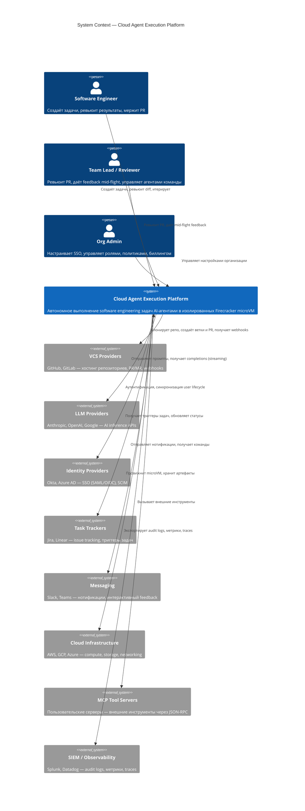

# C4 Model — Level 1: System Context

Cloud Agent Execution Platform — managed SaaS для автономного выполнения software engineering задач AI-агентами в изолированных облачных окружениях.

```mermaid
C4Context
    title System Context — Cloud Agent Execution Platform

    Person(developer, "Software Engineer", "Создаёт задачи, ревьюит результаты, мержит PR")
    Person(teamlead, "Team Lead / Reviewer", "Ревьюит PR, даёт feedback mid-flight, управляет агентами команды")
    Person(admin, "Org Admin", "Настраивает SSO, управляет ролями, политиками, биллингом")

    System(platform, "Cloud Agent Execution Platform", "Автономное выполнение software engineering задач AI-агентами в изолированных Firecracker microVM")

    System_Ext(vcs, "VCS Providers", "GitHub, GitLab — хостинг репозиториев, PR/MR, webhooks")
    System_Ext(llm, "LLM Providers", "Anthropic, OpenAI, Google — AI inference APIs")
    System_Ext(idp, "Identity Providers", "Okta, Azure AD — SSO (SAML/OIDC), SCIM")
    System_Ext(trackers, "Task Trackers", "Jira, Linear — issue tracking, триггеры задач")
    System_Ext(messaging, "Messaging", "Slack, Teams — нотификации, интерактивный feedback")
    System_Ext(cloud, "Cloud Infrastructure", "AWS, GCP, Azure — compute, storage, networking")
    System_Ext(mcp, "MCP Tool Servers", "Пользовательские серверы — внешние инструменты через JSON-RPC")
    System_Ext(siem, "SIEM / Observability", "Splunk, Datadog — audit logs, метрики, traces")

    Rel(developer, platform, "Создаёт задачи, ревьюит diff, итерирует")
    Rel(teamlead, platform, "Ревьюит PR, даёт mid-flight feedback")
    Rel(admin, platform, "Управляет настройками организации")

    Rel(platform, vcs, "Клонирует репо, создаёт ветки и PR, получает webhooks")
    Rel(platform, llm, "Отправляет промпты, получает completions (streaming)")
    BiRel(platform, idp, "Аутентификация, синхронизация user lifecycle")
    Rel(platform, trackers, "Получает триггеры задач, обновляет статусы")
    BiRel(platform, messaging, "Отправляет нотификации, получает команды")
    Rel(platform, cloud, "Провижнит microVM, хранит артефакты")
    Rel(platform, mcp, "Вызывает внешние инструменты")
    Rel(platform, siem, "Экспортирует audit logs, метрики, traces")

    UpdateRelStyle(developer, platform, $offsetY="-40", $offsetX="-100")
    UpdateRelStyle(teamlead, platform, $offsetY="-40")
    UpdateRelStyle(admin, platform, $offsetY="-40", $offsetX="100")
```
