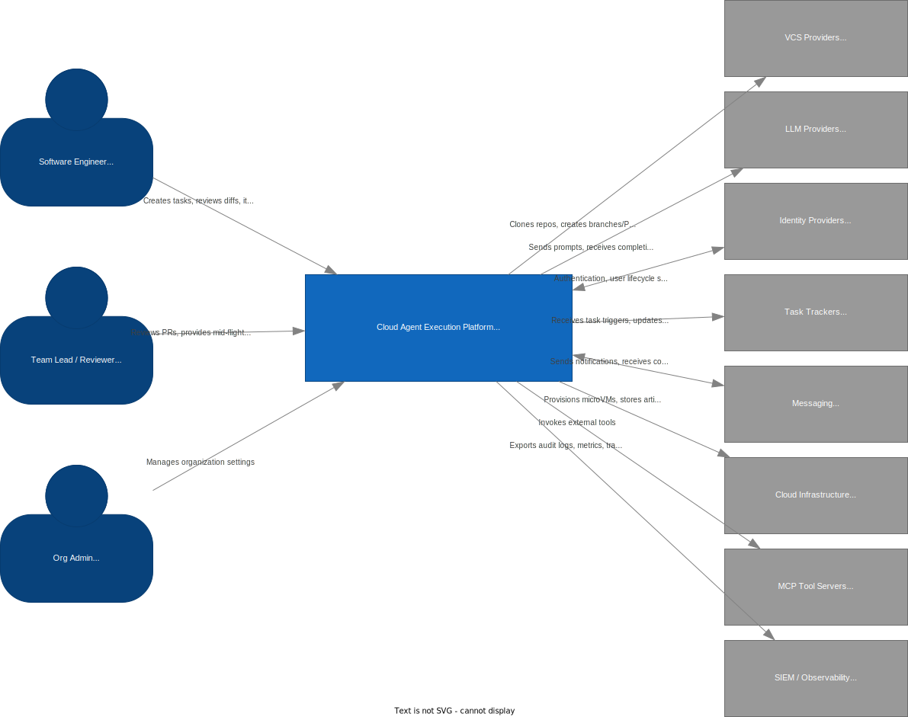

# C4 Model — Level 1: System Context

Cloud Agent Execution Platform — a managed SaaS for autonomous execution of software engineering tasks by AI agents in isolated cloud environments.

> **Level**: C4 System Context (Level 1) — highest-level view of the system and its surroundings
> **Diagram**: [c4-system-context.drawio.svg](c4-system-context.drawio.svg) *(source: [c4-system-context.drawio](c4-system-context.drawio))*

---

## Diagram

---

## Central System

| Name | Type | Description |
|------|------|-------------|
| Cloud Agent Execution Platform | Software System | Autonomous execution of software engineering tasks by AI agents in isolated Firecracker microVMs |

---

## Persons (Actors)

| ID | Name | Description |
|----|------|-------------|
| `developer` | Software Engineer | Creates tasks, reviews results, merges PRs |
| `teamlead` | Team Lead / Reviewer | Reviews PRs, provides mid-flight feedback, manages team agents |
| `admin` | Org Admin | Configures SSO, manages roles, policies, and billing |

---

## External Systems

| ID | Name | Description |
|----|------|-------------|
| `vcs` | VCS Providers | GitHub, GitLab — repository hosting, PR/MR, webhooks |
| `llm` | LLM Providers | Anthropic, OpenAI, Google — AI inference APIs |
| `idp` | Identity Providers | Okta, Azure AD — SSO (SAML/OIDC), SCIM |
| `trackers` | Task Trackers | Jira, Linear — issue tracking, task triggers |
| `messaging` | Messaging | Slack, Teams — notifications, interactive feedback |
| `cloud` | Cloud Infrastructure | AWS, GCP, Azure — compute, storage, networking |
| `mcp` | MCP Tool Servers | Custom servers — external tool invocations via JSON-RPC |
| `siem` | SIEM / Observability | Splunk, Datadog — audit logs, metrics, traces |

---

## Relationships

### Person → Platform

| From | To | Description |
|------|----|-------------|
| Software Engineer | Platform | Creates tasks, reviews diffs, iterates on results |
| Team Lead / Reviewer | Platform | Reviews PRs, provides mid-flight feedback |
| Org Admin | Platform | Manages organization settings |

### Platform → External Systems

| From | To | Direction | Description |
|------|----|-----------|-------------|
| Platform | VCS Providers | → | Clones repos, creates branches and PRs, receives webhooks |
| Platform | LLM Providers | → | Sends prompts, receives completions (streaming) |
| Platform | Identity Providers | ↔ | Authentication, user lifecycle synchronization |
| Platform | Task Trackers | → | Receives task triggers, updates statuses |
| Platform | Messaging | ↔ | Sends notifications, receives commands |
| Platform | Cloud Infrastructure | → | Provisions microVMs, stores artifacts |
| Platform | MCP Tool Servers | → | Invokes external tools |
| Platform | SIEM / Observability | → | Exports audit logs, metrics, traces |

---

## Notes

- This is the highest-level C4 view. The platform is shown as a single box; internal structure is detailed in [C4 Level 2: Container Diagram](c4-container.md).
- Relationships at this level are logical; protocols and technology details are specified at the Container level.
